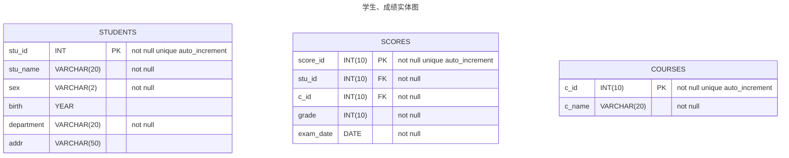
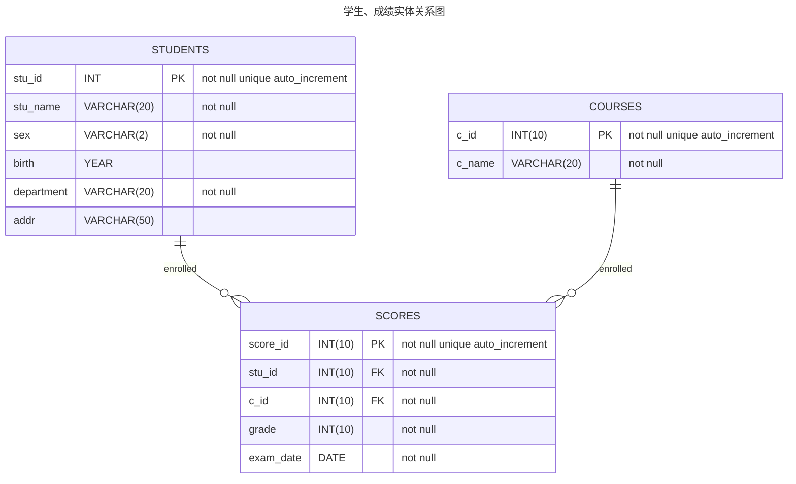
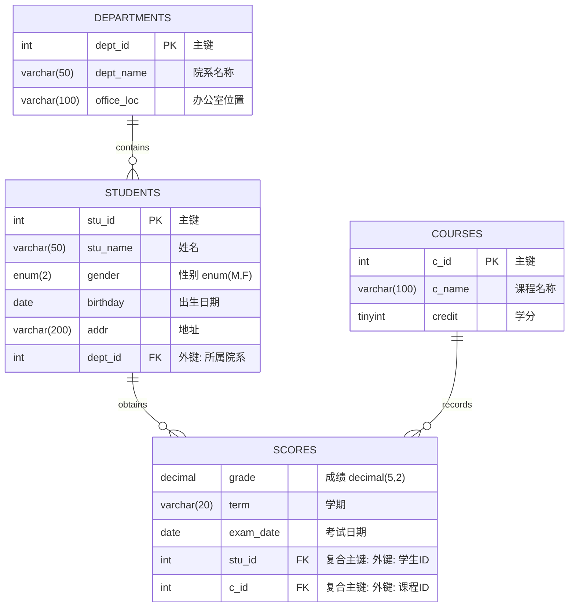
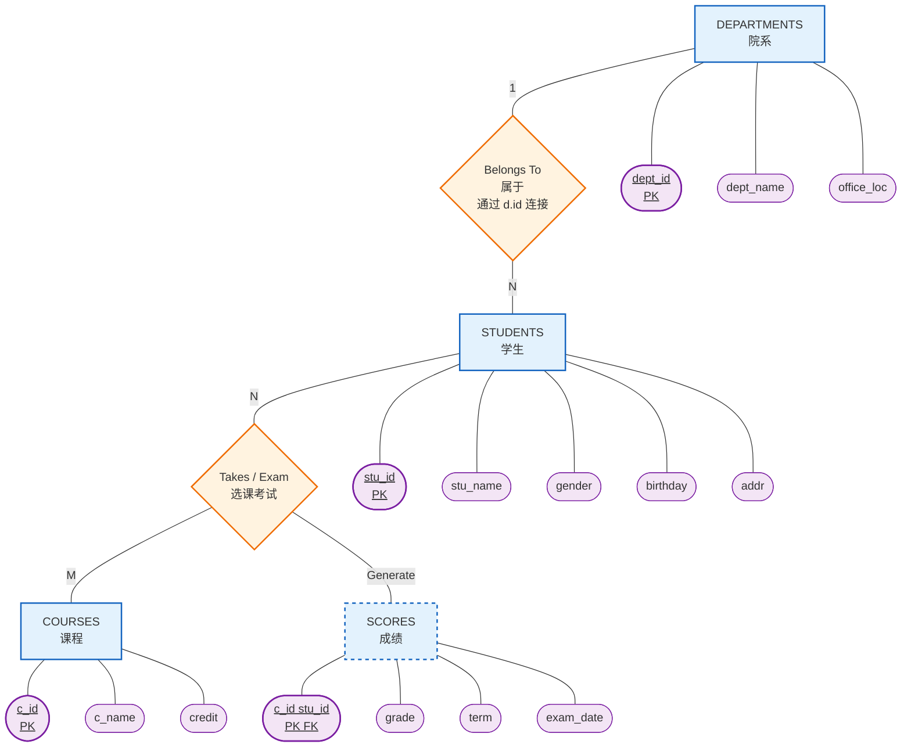

## 学生、成绩关系的数据库

### 实体图

```mermaid
---
title: 学生、成绩实体图
---
erDiagram
    STUDENTS {
        stu_id INT PK "not null unique auto_increment"
        stu_name VARCHAR(20) "not null"
        sex VARCHAR(2) "not null"
        birth YEAR
        department VARCHAR(20) "not null"
        addr VARCHAR(50)
    }

    SCORES {
        score_id INT(10) PK "not null unique auto_increment"
        stu_id INT(10) FK "not null"
        c_id INT(10) FK "not null"
        grade INT(10) "not null"
        exam_date DATE "not null"
    }

    COURSES {
        c_id INT(10) PK "not null unique auto_increment"
        c_name VARCHAR(20) "not null"
    }
```

### 实体关系图

```mermaid
---
title: 学生、成绩实体关系图
---
erDiagram
    STUDENTS {
        stu_id INT PK "not null unique auto_increment"
        stu_name VARCHAR(20) "not null"
        sex VARCHAR(2) "not null"
        birth YEAR
        department VARCHAR(20) "not null"
        addr VARCHAR(50)
    }

    SCORES {
        score_id INT(10) PK "not null unique auto_increment"
        stu_id INT(10) FK "not null"
        c_id INT(10) FK "not null"
        grade INT(10) "not null"
        exam_date DATE "not null"
    }

    COURSES {
        c_id INT(10) PK "not null unique auto_increment"
        c_name VARCHAR(20) "not null"
    }
    
    STUDENTS ||--o{ SCORES : "enrolled"
    COURSES  ||--o{ SCORES : "enrolled"
```

### 实体-关系（优化后）

```mermaid
erDiagram
    %% 1. 院系实体
    DEPARTMENTS {
        int dept_id PK "主键"
        varchar(50) dept_name "院系名称"
        varchar(100) office_loc "办公室位置"
    }

    %% 2. 学生实体
    STUDENTS {
        int stu_id PK "主键"
        varchar(50) stu_name "姓名"
        enum(2) gender "性别 enum(M,F)"
        date birthday "出生日期"
        varchar(200) addr "地址"
        int dept_id FK "外键: 所属院系"
    }

    %% 3. 课程实体
    COURSES {
        int c_id PK "主键"
        varchar(100) c_name "课程名称"
        tinyint credit "学分"
    }

    %% 4. 成绩实体 (作为关联实体存在)
    SCORES {
        decimal grade "成绩 decimal(5,2)"
        varchar(20) term "学期"
        date exam_date "考试日期"
        int stu_id FK "复合主键: 外键: 学生ID"
        int c_id FK "复合主键: 外键: 课程ID"
    }

    %% --- 关系定义 ---

    %% 院系包含多个学生 (1对多)
    DEPARTMENTS ||--o{ STUDENTS : "contains"

    %% 学生拥有多条成绩记录 (1对多)
    STUDENTS ||--o{ SCORES : "obtains"

    %% 课程对应多条成绩记录 (1对多)
    COURSES ||--o{ SCORES : "records"
```

```mermaid
graph TD
    %% --- 样式定义 ---
    classDef entity fill:#e3f2fd,stroke:#1565c0,stroke-width:2px;
    classDef relation fill:#fff3e0,stroke:#ef6c00,stroke-width:2px,shape:diamond;
    classDef attribute fill:#f3e5f5,stroke:#7b1fa2,stroke-width:1px;
    classDef pk fill:#f3e5f5,stroke:#7b1fa2,stroke-width:2px,text-decoration:underline;
    classDef weak_entity fill:#e3f2fd,stroke:#1565c0,stroke-width:2px,stroke-dasharray: 5 5;

    %% --- 主干结构定义 (先定义核心骨架以帮助布局) ---
    DEPT[DEPARTMENTS <br/> 院系]:::entity
    STU[STUDENTS <br/> 学生]:::entity
    CRS[COURSES <br/> 课程]:::entity
    SCORE[SCORES <br/> 成绩]:::weak_entity

    %% --- 关系节点 ---
    REL_DEPT_STU{Belongs To <br/> 属于 <br/>通过 d.id 连接}:::relation
    REL_EXAM{Takes / Exam <br/> 选课考试}:::relation

    %% --- 核心关系连线 (控制层级) ---
    %% 1. 院系 -> 学生
    DEPT ---|1| REL_DEPT_STU
    REL_DEPT_STU ---|N| STU

    %% 2. 学生 - 选课 - 课程 (水平排列)
    STU ---|N| REL_EXAM
    REL_EXAM ---|M| CRS

    %% 3. 选课 -> 成绩 (垂直向下)
    REL_EXAM ---|Generate| SCORE

    %% --- 属性定义 (最后连接，让它们自然散开) ---
    
    %% 院系属性
    DEPT --- d_id([dept_id <br/> PK]):::pk
    DEPT --- d_name([dept_name]):::attribute
    DEPT --- d_loc([office_loc]):::attribute

    %% 学生属性
    STU --- s_id([stu_id <br/> PK]):::pk
    STU --- s_name([stu_name]):::attribute
    STU --- s_gender([gender]):::attribute
    STU --- s_birth([birthday]):::attribute
    STU --- s_addr([addr]):::attribute
    
    %% 课程属性
    CRS --- c_id([c_id <br/> PK]):::pk
    CRS --- c_name([c_name]):::attribute
    CRS --- c_credit([credit]):::attribute

    %% 成绩属性
    SCORE --- sc_id([c_id stu_id <br/> PK FK]):::pk
    SCORE --- sc_grade([grade]):::attribute
    SCORE --- sc_term([term]):::attribute
    SCORE --- sc_date([exam_date]):::attribute
```