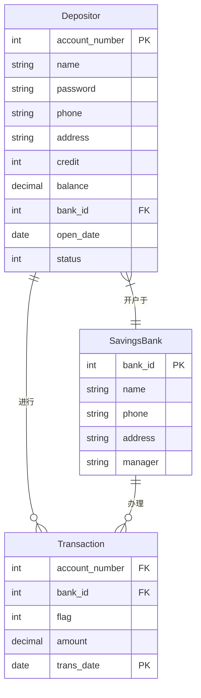
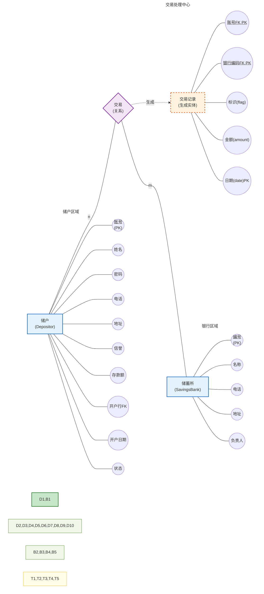

## 活期储蓄管理

### 关系模型

### 关系模型

储户(<u>账号</u>, 姓名, 密码, 电话, 地址, 信誉, 存款额, 开户行, 开户日期, 状态)

储蓄所(<u>编号</u>, 名称, 电话, 地址, 负责人)

交易(账号, 银行编码, 标识, 金额, 日期)

### eER图


### ER图



### 关系结构

>  1.储户进行存取款时应该提供账号、存取标志(1：表示存款，0：表示取款)、存取金额、存取日期等信息，储蓄所首先要对储户的身份进行验证，对合法的储户再根据“信誉”判断是否可以发生此次业务。若发生业务则记录相应信息，修改储户的存款额。
>
> 2.用户定义的完整性：
>
> 对信誉为“一般”的储户取款时，只有当：
>
> “储户.存款额”一“存取款.金额”≥0
>
> 时才可以发生取款业务。
>
> 同理，对信誉为“良好”的储户取款时，只要：
>
> “储户.存款额”一“存取款.金额”≥-50000（元）
>
> 时便可以发生取款业务。

| 关系名称 | 属性名称 | 数据类型 | 宽度 | 说明 |
| --- | --- | --- | --- | --- |
| 储户 | 账号 | 整数 | - | 主键 |
| | 姓名 | 字符串 | - | |
| | 密码 | 字符串 | - | |
| | 电话 | 字符串 | - | |
| | 地址 | 字符串 | - | |
| | 信誉 | 整数 | - | 储户按信誉分为“一般”和“良好”两种（分别用 0 和1 表示）。信誉“一般”的储户不允许透支。信誉“良好”的储户可以透支，但不能超过5 万元。 |
| | 存款额 | 小数 | - |  |
| | 开户行 | 整数 | - | 外键，参照储蓄所(编号) |
| | 开户日期 | 日期 | - | |
| | 状态 | 整数 | - | 储户按状态分为：“正常”和“挂失”两种（分别用 0、1 表示）。状态为“正常”的储户允许存取款，状态为“挂失”的储户不允许存取款。 |
| 储蓄所 | 编号 | 整数 | - | 主键 |
| | 名称 | 字符串 | - | |
| | 电话 | 字符串 | - | |
| | 地址 | 字符串 | - | |
| | 负责人 | 字符串 | - | |
| 交易 | 账号 | 整数 | - | 主键，外键，参照储户(账号) |
| | 银行编码 | 整数 | - | 主键，外键，参照储蓄所(编号) |
| | 标识(flag) | 整数 | - | |
| | 金额(amount) | 小数 | - | |
| | 日期(date) | 日期 | - | 主键|

## 数据库操作部分

### DDL语句

```sql
-- 创建数据库
CREATE DATABASE IF NOT EXISTS savings_management;
USE savings_management;

-- 创建储蓄所表 (SavingsBank)
CREATE TABLE SavingsBank (
    bank_id INT PRIMARY KEY COMMENT '储蓄所编号，主键',
    name VARCHAR(100) NOT NULL COMMENT '储蓄所名称',
    phone VARCHAR(20) COMMENT '联系电话',
    address VARCHAR(200) COMMENT '地址',
    manager VARCHAR(50) COMMENT '负责人'
) COMMENT = '储蓄所信息表';

-- 创建储户表 (Depositor)
CREATE TABLE Depositor (
    account_number INT PRIMARY KEY COMMENT '账号，主键',
    name VARCHAR(50) NOT NULL COMMENT '姓名',
    password VARCHAR(50) NOT NULL COMMENT '密码',
    phone VARCHAR(20) COMMENT '电话',
    address VARCHAR(200) COMMENT '地址',
    credit INT NOT NULL DEFAULT 0 CHECK (credit IN (0, 1)) COMMENT '信誉：0-一般，1-良好',
    balance DECIMAL(15, 2) NOT NULL DEFAULT 0.00 COMMENT '存款余额',
    bank_id INT NOT NULL COMMENT '开户行，外键参照SavingsBank(bank_id)',
    open_date DATE NOT NULL COMMENT '开户日期',
    status INT NOT NULL DEFAULT 0 CHECK (status IN (0, 1)) COMMENT '状态：0-正常，1-挂失',
    
    -- 外键约束
    FOREIGN KEY (bank_id) REFERENCES SavingsBank(bank_id) ON DELETE RESTRICT
) COMMENT = '储户信息表';

-- 创建交易表 (Transaction)
CREATE TABLE Transaction (
    account_number INT NOT NULL COMMENT '账号，外键参照Depositor(account_number)',
    bank_id INT NOT NULL COMMENT '银行编码，外键参照SavingsBank(bank_id)',
    flag INT NOT NULL CHECK (flag IN (0, 1)) COMMENT '标识：0-取款，1-存款',
    amount DECIMAL(15, 2) NOT NULL CHECK (amount > 0) COMMENT '交易金额',
    trans_date TIMESTAMP NOT NULL COMMENT '交易日期',
    
    -- 复合主键
    PRIMARY KEY (account_number, bank_id, trans_date),
    
    -- 外键约束
    FOREIGN KEY (account_number) REFERENCES Depositor(account_number) ON DELETE RESTRICT,
    FOREIGN KEY (bank_id) REFERENCES SavingsBank(bank_id) ON DELETE RESTRICT
) COMMENT = '交易记录表';


```

### 插入模拟数据

```sql
-- 使用已创建的数据库
USE savings_management;

-- 1. 插入储蓄所数据 (SavingsBank)
INSERT INTO SavingsBank (bank_id, name, phone, address, manager) VALUES
(1001, '中国建行杭州分行秋涛支行', '(0571) 88049082', '秋涛北街283号', NULL),
(1002, '中国建行杭州分行武林支行', '(0571) 68066080', '武林南路366号', NULL),
(1208, '中国建行杭州分行下沙支行', '(0571) 28800088', '下沙22号大街788号', NULL),
(1303, '中国建行杭州分行滨江支行', '(0571) 26880266', '滨江18号大街632号', NULL);

-- 2. 插入储户数据 (Depositor) - 合并基本信息和动态信息
INSERT INTO Depositor (account_number, name, password, phone, address, credit, balance, bank_id, open_date, status) VALUES
(10020169, '张晓军', 'ASDZXC', '(0571) 22959618', '杭州', 0, 286000.00, 1002, '2002-11-20', 1),
(10020123, '李丹娜', 'WERERT', '(021) 86129618', '上海', 1, 1678120.00, 1208, '2016-08-06', 1),
(10245082, '张岚', 'DFGASD', '(0571) 66787968', '杭州', 1, 3000000.00, 1002, '1998-06-01', 1),
(10204568, '王立群', 'SDFCVB', '(021) 89727982', '上海', 0, 35000.00, 1303, '2004-01-08', 1),
(10204567, '赵庆', 'CVBGHJ', '(0571) 28008986', '杭州', 1, 1201600.00, 1208, '2003-02-08', 1);

-- 3. 插入交易数据 (Transaction)
-- 注意：交易日期不能重复（复合主键约束），这里调整部分日期以避免冲突
INSERT INTO Transaction (account_number, bank_id, flag, amount, trans_date) VALUES
(10020123, 1002, 1, 50000.00, '2003-09-28'),
(10245082, 1208, 0, 80000.00, '2003-10-16'),
(10020123, 1001, 0, 10000.00, '2003-12-10'),
(10020169, 1303, 1, 12016.00, '2003-12-10'),
(10020123, 1002, 0, 20160.00, '2003-12-16'),
(10245082, 1002, 0, 10000.00, '2004-01-08'),
(10204567, 1208, 1, 20160.00, '2004-02-08'),
(10245082, 1208, 1, 30000.00, '2004-03-16');

-- 创建索引以提高查询性能
CREATE INDEX idx_depositor_bank ON Depositor(bank_id);
CREATE INDEX idx_depositor_status ON Depositor(status);
CREATE INDEX idx_transaction_date ON Transaction(trans_date);
CREATE INDEX idx_transaction_account ON Transaction(account_number);
CREATE INDEX idx_transaction_bank ON Transaction(bank_id);
```

